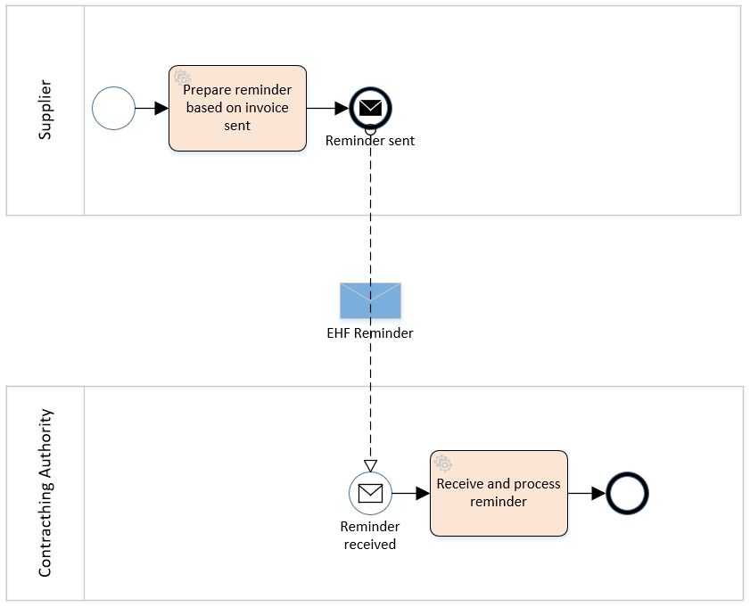

:shared-dir: ../../shared
:lang: en
:doctitle: EHF Reminder 2.0

include::{shared-dir}/settings.adoc[]

= {doctitle}
{name-difi-en}
v2.0.0 RC
:doctype: book
:icons: font
:toc: left
:toclevels: 2
:source-highlighter: coderay
:source-language: xml
:sectanchors:
:sectnums:
:title-logo-image: {shared-dir}/images/logo.jpg

:leveloffset: +1

This document describe EHF reminder format to be used for the exchange of electronic reminder information between
trading partners. This document is a part of Norwegian "Agency of Public Management and eGovernment" (Difi) standardization work related to
electronic commerce.

include::definitions.adoc[]

= Background
// Nytt

If contracting authority does not pay the invoice sent from supplier according to payment terms, supplier can
send a reminder. Regulation describing terms that must be fulfilled before sending EHF reminder you can find
here: https://lovdata.no/dokument/NL/lov/1988-05-13-26/

An electronic sent reminder is regulated through §3a: https://lovdata.no/NL/lov/1988-05-13-26/§3a

= Process

== The Reminder Process and Typical Use Case

A supplier has sent an EHF invoice to get paid for an assignment or products ordered from contracting authority (CA).
Payment terms is agreed upon in the contract.

The supplier accounting system prepare an EHF reminder when deadline for payment is passed according to current
regulation “Lov om inkassovirksomhet og annen inndriving av forfalte pengekrav (inkassoloven)”

EHF reminder is being sent to contracting authority through supplier access point. Contracting authority receives EHF
reminder and pays the supplier the amount based on received invoice.

== Reminder Process Diagram

The following diagram show the choreography of the EHF reminder process.

.EHF Reminder process.

== Use case

A supplier has sent an EHF invoice to get paid for an assignment or products ordered from contracting authority (CA).
Payment terms is agreed upon in the contract.

The supplier accounting system prepare an EHF reminder when deadline for payment is passed according to current
regulation “Lov om inkassovirksomhet og annen inndriving av forfalte pengekrav (inkassoloven).”

EHF reminder is being sent to contracting authority through supplier access point. Contracting authority receives EHF
reminder and pays the supplier the amount based on received invoice.

= Detailed descriptions

This chapter describes selected parts of the information contents of the EHF reminder.

== Roles and Actor

The following roles may be specified in the format. The same actor may play more than one role depending on the
handling routine.

****
Seller (AccountingSupplierParty):: Seller is mandatory information in EHF.

Buyer (AccountingCustomerParty):: Buyer is mandatory information in EHF.

Payment receiver (PayeeParty):: Payment receiver is optional information in EHF. If this information is not supplied,
the seller is the payment receiver.
****

The following diagram shows the business processes to the roles performed by the business partners.

.EHF Reminder rolediagram.
image::images/rolediagram.png[align="center"]

=== Supplier Information

[source,xml]
.Example: Supplying seller information on the header level in an EHF reminder message.
----
<cac:AccountingSupplierParty>
    <cac:Party>
        <cbc:EndpointID schemeID="0192">987654325</cbc:EndpointID>
        <cac:PartyIdentification>
            <cbc:ID schemeID="0192">987654325</cbc:ID>
        </cac:PartyIdentification>
        <cac:PartyName>
            <cbc:Name>Penner og sånt AS</cbc:Name>
        </cac:PartyName>
        <cac:PostalAddress>
            <cbc:StreetName>Dronningsgate 12</cbc:StreetName>
            <cbc:AdditionalStreetName>Building C</cbc:AdditionalStreetName>
            <cbc:CityName>Trondheim</cbc:CityName>
            <cbc:PostalZone>7030</cbc:PostalZone>
            <cbc:CountrySubentity>Trondheim</CountrySubentity>
            <cac:AddressLine>
                <cbc:Line>1st floor</cbc:Line>
            </cac:AddressLine>
            <cac:Country>
                <cbc:IdentificationCode>NO</cbc:IdentificationCode>
            </cac:Country>
        </cac:PostalAddress>
        <cac:PartyLegalEntity>
            <cbc:RegistrationName>Selger AS</cbc:RegistrationName>
            <cbc:CompanyID>999999999</cbc:CompanyID>
            <cac:RegistrationAddress>
                <cbc:CityName>Oslo</cbc:CityName>
                <cac:Country>
                    <cbc:IdentificationCode>NO</cbc:IdentificationCode>
                </cac:Country>
            </cac:RegistrationAddress>
        </cac:PartyLegalEntity>
        <cac:Contact>
            <cbc:ID>22DA14</cbc:ID>
            <cbc:Name>Hans Hansen</cbc:Name>
            <cbc:Telephone>22222222</cbc:Telephone>
            <cbc:ElectronicMail>hans.hansen@pennerogsant.no</cbc:ElectronicMail>
        </cac:Contact>
    </cac:Party>
</cac:AccountingSupplierParty>
----

=== Buyers Information
[source,xml]
.Example: Supplying buyer information on the header level in an EHF reminder message.
----
<cac:AccountingCustomerParty>
    <cac:Party>
        <cbc:EndpointID schemeID="0192">123456785</cbc:EndpointID>
        <cac:PartyIdentification>
            <cbc:ID schemeID="0192">123456785</cbc:ID>
        </cac:PartyIdentification>
        <cac:PartyName>
            <cbc:Name>Pennalhuset AS</cbc:Name>
        </cac:PartyName>
        <cac:PostalAddress>
            <cbc:StreetName>Heimdalsgata 37</cbc:StreetName>
            <cbc:AdditionalStreetName>Building A</cbc:AdditionalStreetName>
            <cbc:CityName>Oslo</cbc:CityName>
            <cbc:PostalZone>0578</cbc:PostalZone>
            <cbc:CountrySubentity>Trondheim</CountrySubentity>
            <cac:AddressLine>
                <cbc:Line>2nd floor</cbc:Line>
            </cac:AddressLine>
            <cac:Country>
                <cbc:IdentificationCode>NO</cbc:IdentificationCode>
            </cac:Country>
        </cac:PostalAddress>
        <cac:PartyLegalEntity>
            <cbc:RegistrationName>Energidrikk AS</cbc:RegistrationName>
            <cbc:CompanyID>123455555</cbc:CompanyID>
            <cac:RegistrationAddress>
                <cbc:CityName>Bergen</cbc:CityName>
                <cac:Country>
                    <cbc:IdentificationCode>NO</cbc:IdentificationCode>
                </cac:Country>
            </cac:RegistrationAddress>
        </cac:PartyLegalEntity>
        <cac:Contact>
            <cbc:ID>3159bbx</cbc:ID>
            <cbc:Name>Heidi Seiers</cbc:Name>
            <cbc:Telephone>517287</cbc:Telephone>
            <cbc:ElectronicMail>heidi.seiers@pennalhuset.no</cbc:ElectronicMail>
        </cac:Contact>
    </cac:Party>
</cac:AccountingCustomerParty>
----

== Payment Instructions

The payment instructions in EHF Reminder need to be specified under the element "cac:PaymentMeans".

[source,xml]
.Example: Payment instructions.
----
<cac:PaymentMeans>
    <cbc:PaymentMeansCode>Bank transaction</cbc:PaymentMeansCode>
    <cbc:PaymentID>1. warning</cbc:PaymentID>
    <cac:PayeeFinancialAccount> <1>
            <cbc:ID>05111125551</cbc:ID>
            <cbc:Name>Ola Nordmenn</cbc:Name>
            <cac:FinancialInstitutionBranch>
                <cbc:ID>Bank X</cbc:ID>
            </cac:FinancialInstitutionBranch>
    </cac:PayeeFinancialAccount>
</cac:PaymentMeans>
----
<1>The payee's financial account.

== Allowance Charge

To send a reminder with a charge (called "gebyr" in Norwegian) we can use the class-element "AllowanceCharge" on document level.

[source,xml]
.Example: Allowance charge (reminder amount).
----
<cac:AllowanceCharge>
    <cbc:ChargeIndicator>True</cbc:ChargeIndicator> <1>
    <cbc:AllowanceChargeReasonCode>Reminder</cbc:AllowanceChargeReasonCode>
    <cbc:Amount currencyID ="NOK">70</cbc:Amount> <2>
</cac:AllowanceCharge>
----
<1> Using fixed value "True" such that allowance charge describes a charge.
<2> The amount of a charge.

//== Invoice- Credit note Reference
//There is mandatory to send invoice reference and/or credit note reference on line level (called "BillingReference").
// LEGG TIL EKSEMPEL.

== Debit and Credit Line Amount

The line amount, referring to outstanding invoice, specifies in the element "DebitLineAmount".
Similarly for Credit note in the element "CreditLineAmount".

[source,xml]
.Example: Debit line amount.
----
<cac:ReminderLine>
    <cbc:ID>1</cbc:ID>
    <cbc:Note>Purring 12345</cbc:Note>
    <cbc:DebitLineAmount currencyID="NOK">500</cbc:DebitLineAmount> <1>
</cac:ReminderLine>
----
<1> Debit line amount with correct currency.

[source,xml]
.Example: Credit line amount.
----
<cac:ReminderLine>
    <cbc:ID>2</cbc:ID>
    <cbc:Note>Kreditnota 6545</cbc:Note>
    <cbc:CreditLineAmount currencyID="NOK">100</cbc:CreditLineAmount> <1>
</cac:ReminderLine>
----
<1> Credit line amount with correct currency.

The total amount of debit line amount minus the total amount of credit line amount MUST be referred in the element "LineExtensionAmount"
under the the element "LegalMonetaryTotal" on document level.

[source,xml]
.Example: Credit line amount.
----
<cac:LegalMonetaryTotal>
    <cbc:LineExtensionAmount currencyID="NOK">400<cbc:LineExtensionAmount> <1>
    <cbc:PayableAmount currencyID="NOK">100<cbc:PayableAmount> <2>
</cac:LegalMonetaryTotal>
----
<1> The sum of all line net amounts in the reminder (total amount of debit line amount minus the total amount of credit line).
<2> The outstanding total amount that is requested to be paid.

== Value Added Tax (Norwegian MVA)

VAT categories used in Norway, from July 1 2013, are specified in the table below. Use of other VAT categories than
those specified below leads to rejection of the XML instance document during validation.

.Table: Valid VAT categories and rates

|===
|VAT Category |Description |Rate of January 1, 2016

|S
|Output VAT, regular rate
|25%

|H
|Output VAT, reduced rate, middle
|15%

|R
|Output VAT, reduced rate, raw fish
|11,11%

|AA
|Output VAT, reduced rate, low
|10%

|E
|VAT excempt
|0%

|Z
|VAT excempt (Goods and services not included in the VAT regulations)
|0%

|K
|Emission allowances for private or public businesses – buyer calculates VAT
|0%

|AE
|Reversed VAT
|0%

|G
|Export if goods and services
|0%
|===
