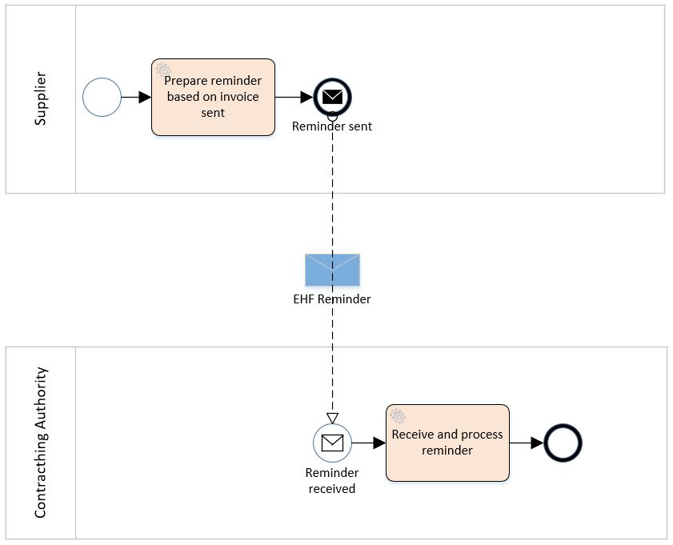

:shared-dir: ../../_common
:lang: en
:doctitle: EHF Reminder 3.0

include::{shared-dir}/settings.adoc[]

= {doctitle}
{name-difi-en}
v3.0.1
:doctype: book
:icons: font
:toc: left
:toclevels: 2
:source-highlighter: coderay
:source-language: xml
:sectanchors:
:sectnums:
:title-logo-image: {shared-dir}/images/logo.jpg

:leveloffset: +1

This document describe EHF Reminder (called "EHF Purring" in Norwegian)format to be used for the exchange of electronic reminder information between
trading partners. This document is a part of Norwegian Digitalisation Agency (Digdir) standardization work related to
electronic commerce.

include::definitions.adoc[]

= Background
// Nytt

If contracting authority does not pay the invoice sent from supplier according to payment terms, supplier can
send a reminder. Regulation describing terms that must be fulfilled before sending EHF reminder you can find
here: https://lovdata.no/dokument/NL/lov/1988-05-13-26/

An electronic sent reminder is regulated through §3a: https://lovdata.no/NL/lov/1988-05-13-26/§3a

= Process

== The Reminder Process and Typical Use Case

A supplier has sent an EHF invoice to get paid for an assignment or products ordered from contracting authority (CA).
Payment terms is agreed upon in the contract.

The supplier accounting system prepare an EHF reminder when deadline for payment is passed according to current
regulation “Lov om inkassovirksomhet og annen inndriving av forfalte pengekrav (inkassoloven)”

EHF reminder is being sent to contracting authority through supplier access point. Contracting authority receives EHF
reminder and pays the supplier the amount based on received invoice.

== Reminder Process Diagram

The following diagram show the choreography of the EHF reminder process.

.EHF Reminder process.

== Use case

A supplier has sent an EHF invoice to get paid for an assignment or products ordered from contracting authority (CA).
Payment terms is agreed upon in the contract.

The supplier accounting system prepare an EHF reminder when deadline for payment is passed according to current
regulation “Lov om inkassovirksomhet og annen inndriving av forfalte pengekrav (inkassoloven).”

EHF reminder is being sent to contracting authority through supplier access point. Contracting authority receives EHF
reminder and pays the supplier the amount based on received invoice.

= Implementation

EHF Reminder is based upon link:http://docs.peppol.eu/poacc/billing/3.0/[PEPPOL BIS Billing 3.0] and link:https://vefa.difi.no/ehf/g3/billing-3.0/norway/[EHF Billing 3.0] where the datamodel is limited to the information needed to recognize and pay the original invoice.

== Business terms

The following business terms are removed in EHF Reminder 3.0 compared to PEPPOL BIS Billing 3.0:

* BT-3
* BG-14 (Including BT-73, BT-74, BT-8)
* BT-13
* BT-14
* BT-16
* BT-15
* BT-17
* BT-18
* BG-24 (Including BT-122, BT-123, BT-124, BT-125)
* BT-11
* BG-13 (Including BT-70, BT-71, BT-72, BG-15, BT-75, BT-76, BT-77, BT-78, BT-79, BT-80, BT-165)
* BG-18 (Including BT-87, BT-88)
* BG-19 (Including BT-89, BT-91)
* BT-128
* BT-154
* BT-155
* BT-156
* BT-157
* BT-158
* BT-159
* BG-32 (Including BT-160, BT-161)

== Cardinalities

The following changes are made to cardinalities in EHF Reminder 3.0 compared to PEPPOL BIS Billing 3.0:

[cols="2,1,1",options="header"]
|===
| Business term
| New cardinality
| Original cardinality

| BG-3
| 1..1
| 0..n
|===

== Code lists

A new code list is introduced as an addition to codes part of UNCL7161 named "Reminder charge reason code" used to indicate charges added as part of the reminder. The new code list contains only the code "REM", and is used in BT-105.

= Description

This chapter describes selected parts of the information contents of the EHF reminder.

== Reminder charge

To send a reminder with a charge (called "gebyr" in Norwegian) we use the element "AllowanceCharge" on document level.

[source,xml]
.Example: Reminder charge (reminder amount).
----
<cac:AllowanceCharge>
  <cbc:ChargeIndicator>true</cbc:ChargeIndicator> <1>
  <cbc:AllowanceChargeReasonCode>REM</cbc:AllowanceChargeReasonCode>
  <cbc:Amount currencyID="NOK">70</cbc:Amount> <2>
  <cac:TaxCategory>
    <cbc:ID>E</cbc:ID>
    <cbc:Percent>0</cbc:Percent>
    <cbc:TaxExemptionReason>Exempt</cbc:TaxExemptionReason>
    <cac:TaxScheme>
      <cbc:ID>VAT</cbc:ID>
    </cac:TaxScheme>
  </cac:TaxCategory>
</cac:AllowanceCharge>
----
<1> Using fixed value "true" such that allowance charge describes a charge.
<2> The amount of a charge.
