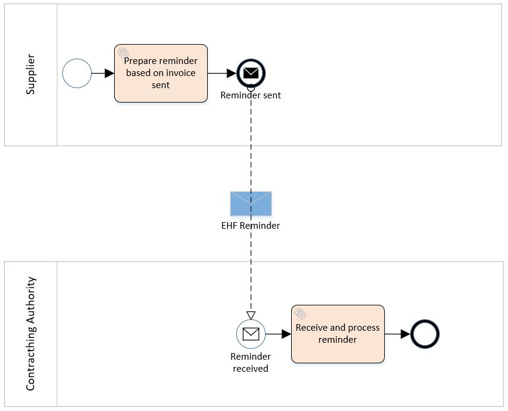

= EHF Reminder
Difi
v2.0.0-dev
:doctype: book
:icons: font
:toc: left
:toclevels: 2
:source-highlighter: coderay
:sectanchors:
:sectnums:

:leveloffset: +1

This document describe EHF reminder format to be used for the exchange of electronic reminder information between
trading partners. This document is a part of Norwegian "Agency of Public Management and eGovernment" (Difi) standardization work related to
electronic commerce.

= Definitions

****
Reminder::
A document that remind the customer that a payment is delayed.

Invoice::
A commercial document confirming a sale between a seller and a buyer. The invoice is issued by the seller and the buyer
has to pay the claim.

Electronic Invoice::
An invoice transferred electronically from the issuer to the receiver. The invoice is imported into and processed by
the receiver’s computerized accounting system.

Credit note::
A commercial document cancelling all or part of an invoice already issued. The Credit note must have a distinct
reference to the originating invoice.

Electronic Credit note::
A credit note transferred electronically from the issuer to the receiver. The credit note is imported into and
processed by the receiver’s computerized accounting system.

Supplier::
Person or company supplying goods or services on own or someone else’s behalf.

Customer::
Person or organization acquiring the ownership of a product or a service against agreed price and payment terms.

Seller::
Person or organization with the necessary authority to sign a contract and transfer the ownership of a product or
service.

Buyer::
Person or organization acquiring the ownership of a product or a service for an agreed price and payment terms.

Invoice Issuer::
Person or organization that issues an invoice.

Invoice Receiver::
Person or organization that receives an invoice.

Payment Receiver::
Person or organization that receives the payment
****

= Process

== The Reminder Process

A supplier has sent an EHF invoice to get paid for an assignment or products ordered from contracting authority (CA).
Payment terms is agreed upon in the contract.

The supplier accounting system prepare an EHF reminder when deadline for payment is passed according to current
regulation “Lov om inkassovirksomhet og annen inndriving av forfalte pengekrav (inkassoloven)”

EHF reminder is being sent to contracting authority through supplier access point. Contracting authority receives EHF
reminder and pays the supplier the amount based on received invoice.

.EHF Reminder process.

= Description of Selected Parts of EHF Invoice Messages

This chapter describes selected parts of the information contents of the EHF reminder.

== Roles and Actor

The following roles may be specified in the format. The same actor may play more than one role depending on the
handling routine.

****
Seller (AccountingSupplierParty):: Seller is mandatory information in EHF.

Buyer (AccountingCustomerParty):: Buyer is mandatory information in EHF.

Payment receiver (PayeeParty):: Payment receiver is optional information in EHF. If this information is not supplied,
the seller is the payment receiver.
****

=== Supplier Information

[source,xml]
.Example: Supplying seller information on the header level in an EHF reminder message.
----
<cac:AccountingSupplierParty>
    <cac:Party>
        <cbc:EndpointID schemeID="0192">987654325</cbc:EndpointID>
        <cac:PartyIdentification>
            <cbc:ID>STT134</cbc:ID>
        </cac:PartyIdentification>
        <cac:PartyName>
            <cbc:Name>Penner og sånt AS</cbc:Name>
        </cac:PartyName>
        <cac:PostalAddress>
            <cbc:StreetName>Dronningsgate 12</cbc:StreetName>
            <cbc:CityName>Trondheim</cbc:CityName>
            <cbc:PostalZone>7030</cbc:PostalZone>
            <cac:Country>
                <cbc:IdentificationCode>NO</cbc:IdentificationCode>
            </cac:Country>
        </cac:PostalAddress>
        <cac:PartyLegalEntity>
            <cbc:RegistrationName>The Sellercompany AS</cbc:RegistrationName>
            <cbc:CompanyID schemeID="NO:ORGNR" schemeName="Foretaksregisteret" schemeAgencyID="82">123456789</cbc:CompanyID>
            <cac:RegistrationAddress>
                <cbc:CityName>Oslo</cbc:CityName>
                <cac:Country>
                    <cbc:IdentificationCode>NO</cbc:IdentificationCode>
                </cac:Country>
            </cac:RegistrationAddress>
        </cac:PartyLegalEntity>
    </cac:Party>
</cac:AccountingSupplierParty>
----

=== Buyers Information
[source,xml]
.Example: Supplying buyer information on the header level in an EHF reminder message.
----
<cac:AccountingCustomerParty>
    <cac:Party>
        <cbc:EndpointID>9908:123456789</cbc:EndpointID>
        <cac:PartyIdentification>
            <cbc:ID>345KS5324</cbc:ID>
        </cac:PartyIdentification>
        <cac:PartyName>
            <cbc:Name>Buyercompany ltd</cbc:Name>
        </cac:PartyName>
        <cac:PostalAddress>
            <cbc:StreetName>Anystreet</cbc:StreetName>
            <cbc:CityName>Anytown</cbc:CityName>
            <cbc:PostalZone>0612</cbc:PostalZone>
            <cac:Country>
                <cbc:IdentificationCode listID="ISO3166-1" listAgencyID="6">NO</cbc:IdentificationCode>
            </cac:Country>
        </cac:PostalAddress>
        <cac:PartyLegalEntity>
            <cbc:RegistrationName>The buyercompany AS</cbc:RegistrationName>
            <cbc:CompanyID schemeAgencyID="NO:ORGNR" schemeID="82">888888888</cbc:CompanyID>
            <cac:RegistrationAddress>
                <cbc:CityName>Anycity</cbc:CityName>
                <cac:Country>
                    <cbc:IdentificationCode>NO</cbc:IdentificationCode>
                </cac:Country>
            </cac:RegistrationAddress>
        </cac:PartyLegalEntity>
        <cac:Contact>
            <cbc:ID>3159bbx</cbc:ID>
            <cbc:Telephone>517287</cbc:Telephone>
            <cbc:Telefax>517288</cbc:Telefax>
            <cbc:ElectronicMail>jenny@buyercompany.no</cbc:ElectronicMail>
        </cac:Contact>
    </cac:Party>
</cac:AccountingCustomerParty>
----

== Invoice- Credit note Reference

The invoice reference and/or credit note reference on line level (BillingReference) must be send. See example below.

// LEGG TIL EKSEMPEL.

== Debit and Credit Line Amount

// Beskriv hva dette er.

[source,xml]
.Example: Debit line amount.
----
<cac:ReminderLine>
    <cbc:ID>1</cbc:ID>
    <cbc:Note>Applies to reminder 12345</cbc:Note>
    <cbc:DebitLineAmount currencyID="NOK">100</cbc:DebitLineAmount>
    <cac:BillingReference>
        <cac:InvoiceDocumentReference>
            <cbc:ID>1232</cbc:ID>
        </cac:InvoiceDocumentReference>
    </cac:BillingReference>
</cac:ReminderLine>
----

[source,xml]
.Example: Credit line amount.
----
<cac:ReminderLine>
    <cbc:ID>2</cbc:ID>
    <cbc:Note>Applies to creditnote 6545</cbc:Note>
    <cbc:CreditLineAmount currencyID="NOK">100</cbc:CreditLineAmount>
    <cac:BillingReference>
        <cac:CreditNoteDocumentReference>
            <cbc:ID>53234</cbc:ID>
        </cac:CreditNoteDocumentReference>
    </cac:BillingReference>
</cac:ReminderLine>
----

== Value Added Tax (Norwegian MVA)

VAT categories used in Norway as of July 1, 2013 are specified in the table below. Use of other VAT categories than
those specified below leads to rejection of the XML instance document during validation.

.Table: Valid VAT categories and rates

|===
|VAT Category |Description |Rate of January 1, 2016

|S
|Output VAT, regular rate
|25%

|H
|Output VAT, reduced rate, middle
|15%

|R
|Output VAT, reduced rate, raw fish
|11,11%

|AA
|Output VAT, reduced rate, low
|10%

|E
|VAT excempt
|0%

|Z
|VAT excempt (Goods and services not included in the VAT regulations)
|0%

|K
|Emission allowances for private or public businesses – buyer calculates VAT
|0%

|AE
|Reversed VAT
|0%

|G
|Export if goods and services
|0%
|===

