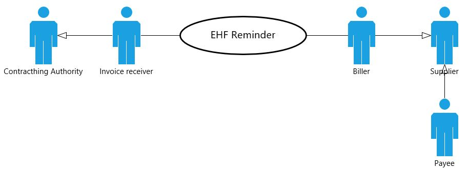

= EHF Reminder
Difi
v2.0.0-dev
:doctype: book
:icons: font
:toc: left
:toclevels: 2
:source-highlighter: coderay
:sectanchors:
:sectnums:

:leveloffset: +1

This document describe EHF reminder format to be used for the exchange of electronic reminder information between
trading partners. This document is a part of Norwegian "Agency of Public Management and eGovernment" (Difi) standardization work related to
electronic commerce.

NOTE: Please use Github Issues to report bugs and lack of content when discovered. Users currently not registered on
Github may create an account for free.

== Introduction

=== Background and Purpose

The government white paper labeled "St.Meld. nr.36 Det gode innkjøp" (The good procurement), stated among other things:

"It’s the Government’s opinion that increased use of electronic solutions is important to improve and increase the
efficiency of public procurement. The use of electronic solutions may reduce time spent on public procurement,
increase the competition and arrange for purchases to be more transparent and easier to re-examine. By spending
less time and money on procurement, resources will be available for both modernizing the public sector and more welfare.
The goal for introducing electronic solutions is to contribute to a better, simpler and more secure procurement."

The previous "Ministry of Government Administration, Reform and Church Affairs" (FAD) considered use of open standards
as a vital means to build a well-functioning public administration, with good internal collaboration and a high level
of service for both inhabitants and businesses.

*Definition of open standards:*

"An open standard is characterized by its reputation and will be maintained by a non-commercial organization, and the
continuing development is based on decision processes open to every interested party. The standard is published and
the documentation is available, either free of charge or for a small, insignificant fee. Anyone must be allowed to copy,
distribute and use the standard free of charge or for a small, insignificant fee. The intellectual rights related to
the standard (e.g. patents) are irrevocably available, without any royalties. There is no reservation regarding re-use
of the standard."

*The purpose* of this document is to describe a common format for electronic reminder in the the Norwegian market,
and to facilitate an efficient implementation and increased use of electronic collaboration based on this format.

=== Target Audience

The target audience for this implementation guide is both professional (faglig?) and technical personnel in organizations aiming at
performing the reminder process completely or partially electronic. That means issuing an invoice, a credit note and
a reminder. This document may also benefit system suppliers, ERP suppliers and message brokers.

The chapters consists of:
* Chapter one to five are directed to professional (faglig ?) personnel.
* Chapter six to eight (attachments) are directed to technical personnel.

=== Document Structure

This document is divided into:

* Chapter one
* Chapter two
* Chapter three...

=== Mandatory Use

This version is valid from 9. january 2013. Mandatory from SKRIV NOE!!.

= Changelog

|===
|Version |Comments |Authors |Date

|1.0
|Initial version
|Bao Nguyen, Difi
|28.01.2011

|1.1
|Fixed various textual adjustment and precisions. Changes are done to:

* EndPointID,

* Organization number,

* Profile and messages.

There are also developed technical and functional changes to:

* use of norwegian profile, biixy, and the only accepted profile of reminder,

* must include supplier's street name and removed the customer,

* recommend to include the supplier's and customer's legal names.
| Olav A. Kristiansen, Difi

Jostein Frømyr, Edisys

Erik Gustavsen, Edisys
| 08.01.2013

|===

= Electronic Commerce Format (EHF)

== About EHF

EHF  is an anagram of the Norwegian expression "Elctronisk handelsformat" (Electronic Commerce Format).

EHF is based on the work performed by CEN BII. This is further adjusted to comply with the Norwegian accounting
regulations and current practices for the different business processes in the Norwegian market. Difi pursues the goal
to cover the full trading process using EHF documents, both before and after awarding (signing of a contract).

Documents, from the tender catalogue to the credit note will be gathered under the EHF umbrella. During 2013 Difi will
prepare for the use of EHF formats in what is known as the post award process, i.e. the part of the business process
that starts when a supplier and a customer have signed a contract.

By using the EHF documents the collaboration between the supplier and the customer will be predictable. Elements from
the tender Catalogue will be re-used in the Order, and elements from the Order will be re-used in the Invoice. This
leads to a holistic use of all the documents under the EHF umbrella.

Difi has chosen to use CEN BII as a base for the EHF formats and the Universal Business Language (UBL) as a foundation
for the implemented syntax. Both EHF and UBL are open standards and as such not liable to any licensing fees or royalties.

EHF is managed and maintained by Difi.

== Information Consistency

The different EHF-formats mentioned above contain a number of common information elements (supplier, customer, item etc.).
It is important to preserve consistency in those common information elements, and that means that elements with identical
content are declared in the same way and as far as possible given the same element tag name.

EHF invoicing formats will for instance re-use elements from the Catalogue and Order to ensure consistency between the
messages and to make sure that the information from the business transactions are reflected in the invoicing documents.
This makes it possible to implement an efficient and automated control of the invoice and the originating transactions.

== Message Transport

OpenPEPPOL Transport Infrastructure will provide an efficient use and transport of the EHF-formats. The objective
is to make it easy for parties in different countries to do cross-border trade. Experience shows that it is easy to
implement electronic messaging in Norway, because most of the service providers use standard processes.

It must be noted that every document scheduled for this infrastructure must be validated with no fatal errors by Difi’s
own validation service. This is likely to be done by the document issuer or by the service provider on behalf of the
document issuer.

According to circular P-10/2012 FAD recommends all central government agencies to use this transport infrastructure.

== Message Level Response

HVA SKAL VI SKRIVE HER??

== Profiles and Messages

In line with the underlying methodology for the EHF formats (see www.cenbi.eu) the electronic messages included in a specific
format will be exchanged between the parties as a part of an electronic collaboration process – a profile.

CEN BII has defined a profile as “A specification of how one or more Business Processes are executed by specifying the
business rules governing its business collaborations and the information content (data model) of the electronic
business transactions exchanged.”

If possible, the EHF is using profiles prepared by BII (see www.cenbii.eu) or PEPPOL (see www.peppol.eu).
Examples of relevant profiles are:

|===
|Profile |Document Types

|Invoice only (bii04)
|Invoice

|Credit note only (biixx)
|Credit note

|Invoice and credit note (bii05)
|Invoice, Credit note

|Invoice, credit note and reminder (biixy)
|Invoice, Credit note, Reminder

|Order and Invoice (bii06)
|Order, Order Response, Invoice, Credit note
|===

The messages being exchanged within a profile are customized to comply with the requirements given for that
particular business document. A CustomizationID is used to identify the business rules that apply to the document
in question, i.e. the whole set of business rules the document issuer founded the document on.

The example CustomizationID below indicates that the contents of the current message is based on business rules
determined by BII (urn:www.cenbii.eu:transaction:biicoretrdm017:ver1.0), extended, customized and clarified by PEPPOL
(urn:www.cenbii.eu:profile:biixy:ver1.0) and further extended, customized and clarified in this implementation guide
regarding the Norwegian businesses in the EHF reminder guide (urn:www.difi.no:ehf:purring:ver1).

[source,xml]
.Example of CustimationID.
----
<cbc:CustomizationID>urn:www.cenbii.eu:transaction:biicoretrdm017:ver1.0:#urn:www.cenbii.eu:profile:biixy:
ver1.0#urn:www.difi.no:ehf:purring:ver1</cbc:CustomizationID>
----

== Use of Collaboration Agreements

The combination of the ELMA registration and the implementation guides referred to in that context eliminates the need
for any formal collaboration agreement between the sender and the receiver. The ELMA registration verifies that an
actor has declared the ability and the commitment to receive business documents composed according to the specific
implementation guide, and any party is free to send the business document to this actor.

Exchanging Catalogue and Order requires no registration in ELMA, and actors are advised to include the use of
electronic messages in the purchase contract or to supply an collaboration agreement as an attachment, in order to
link the electronic collaboration with the mercantile regulations and thus achieve a regularly revision of the
electronic process.

== Versioning

Difi claims the right to exchange the current format with a new one as and when needed. If so, Difi will inform the
public via the web site and their registered users via e-mail.

Difi manages the formats in this way:

****
Main Version::
A new main version will be announced at least 5 months prior to release. When a main version is released, there will
be at least a 12 months implementation period before the new version is made mandatory.
+
Difi intends to relate every main version to the regulations concerning IT standards in the public sector.

Sub Version::
A new sub version will be announced at least 3 months prior to release and is made mandatory 5 months after release.
+
All sub versions must be backwards compatible. 2 months after the new sub version has become mandatory, the support
(validation service and implementation guide) is ceased for preceding versions.

Revision::
A revision is in principle a result of bug fixing the latest sub version, and will be announced at release time and
should be implemented without further delay.
****

= Definitions

****
Reminder::
A document that remind the customer that a payment is delayed.

Invoice::
A commercial document confirming a sale between a seller and a buyer. The invoice is issued by the seller and the buyer
has to pay the claim.

Electronic Invoice::
An invoice transferred electronically from the issuer to the receiver. The invoice is imported into and processed by
the receiver’s computerized accounting system.

Credit note::
A commercial document cancelling all or part of an invoice already issued. The Credit note must have a distinct
reference to the originating invoice.

Electronic Credit note::
A credit note transferred electronically from the issuer to the receiver. The credit note is imported into and
processed by the receiver’s computerized accounting system.

Supplier::
Person or company supplying goods or services on own or someone else’s behalf.

Customer::
Person or organization acquiring the ownership of a product or a service against agreed price and payment terms.

Seller::
Person or organization with the necessary authority to sign a contract and transfer the ownership of a product or
service.

Buyer::
Person or organization acquiring the ownership of a product or a service for an agreed price and payment terms.

Invoice Issuer::
Person or organization that issues an invoice.

Invoice Receiver::
Person or organization that receives an invoice.

Payment Receiver::
Person or organization that receives the payment
****

= Principles and Prerequisites

This chapter describes the principles and assumptions that underlie the use of EHF reminder process.
This is basically similar to the CEN BII 08- Billing with dispute and reminder.

== Functionality and Roles

The diagram below shows the roles involved in the reminder process. In EHF, the customer and invoice recipient is the
same entity, as is the supplier and the invoice issuer.

.Functionality and role diagram.

== Profiles and Messages

All messages contains ProfileID and CustomizationID. ProfileID identifies what business process a given message is
part of, and CustomizationID identifies the kind of message and the rules applied.

Profiles are connected to one business process, and may contain multiple document types. Valid document instances must
contain corresponding ProfileID and CustomizationID.

The listing below are related document types connected to the role of receiver in the conversation. Registration in
ELMA describes the receivers capabilities.

IMPORTANT: CustomizationID is a string without spaces. The list below contains spaces in CustomizationID to make them easier
to read. Make sure to remove any spaces before use.

//profileid og customationID må fylles inn- hvordan?

== The Reminder Process

A supplier has sent an EHF invoice to get paid for an assignment or products ordered from contracting authority (CA).
Payment terms is agreed upon in the contract.

The supplier accounting system prepare an EHF reminder when deadline for payment is passed according to current
regulation “Lov om inkassovirksomhet og annen inndriving av forfalte pengekrav (inkassoloven)”

EHF reminder is being sent to contracting authority through supplier access point. Contracting authority receives EHF
reminder and pays the supplier the amount based on received invoice.

.EHF Reminder process.
image::images/EHFReminder.png[align="center"]

= Description of Selected Parts of EHF Invoice Messages

This chapter describes selected parts of the information contents of the EHF reminder.
Go to chapter 7 (SJEKK OPP??) for the complete information contents.

== Roles and Actor

The following roles may be specified in the format. The same actor may play more than one role depending on the
handling routine.

****
Seller (AccountingSupplierParty):: Seller is mandatory information in EHF.

Buyer (AccountingCustomerParty):: Buyer is mandatory information in EHF.

Payment receiver (PayeeParty):: Payment receiver is optional information in EHF. If this information is not supplied,
the seller is the payment receiver.
****

[source,xml]
.Example: Supplying seller information on the header level in an EHF reminder message.
----
<cac:AccountingSupplierParty>
    <cac:Party>
        <cbc:EndpointID>9908:123456789</cbc:EndpointID>
        <cac:PartyIdentification>
            <cbc:ID>STT134</cbc:ID>
        </cac:PartyIdentification>
        <cac:PartyName>
            <cbc:Name>Salescompany ltd.</cbc:Name>
        </cac:PartyName>
        <cac:PostalAddress>
            <cbc:StreetName>Anystreet</cbc:StreetName>
            <cbc:AdditionalStreetName></cbc:AdditionalStreetName>
            <cbc:CityName>Anytown</cbc:CityName>
            <cbc:PostalZone>0743</cbc:PostalZone>
            <cbc:CountrySubentity>RegionA</cbc:CountrySubentity>
            <cac:AddressLine>
                <cbc:Line></cbc:Line>
            </cac:AddressLine>
            <cac:Country>
                <cbc:IdentificationCode listID="ISO3166-1" listAgencyID="6">NO</cbc:IdentificationCode>
            </cac:Country>
        </cac:PostalAddress>
        <cac:PartyLegalEntity>
            <cbc:RegistrationName>The Sellercompany AS</cbc:RegistrationName>
            <cbc:CompanyID schemeID="NO:ORGNR" schemeName="Foretaksregisteret" schemeAgencyID="82">123456789</cbc:CompanyID>
            <cac:RegistrationAddress>
                <cbc:CityName>Oslo</cbc:CityName>
                <cbc:CountrySubentity>RegionA</cbc:CountrySubentity>
                <cac:Country>
                    <cbc:IdentificationCode>NO</cbc:IdentificationCode>
                </cac:Country>
            </cac:RegistrationAddress>
        </cac:PartyLegalEntity>
    </cac:Party>
</cac:AccountingSupplierParty>
----

[source,xml]
.Example: Supplying buyer information on the header level in an EHF reminder message.
----
<cac:AccountingCustomerParty>
    <cac:Party>
        <cbc:EndpointID>9908:123456789</cbc:EndpointID>
        <cac:PartyIdentification>
            <cbc:ID>345KS5324</cbc:ID>
        </cac:PartyIdentification>
        <cac:PartyName>
            <cbc:Name>Buyercompany ltd</cbc:Name>
        </cac:PartyName>
        <cac:PostalAddress>
            <cbc:StreetName>Anystreet</cbc:StreetName>
            <cbc:AdditionalStreetName></cbc:AdditionalStreetName>
            <cbc:CityName>Anytown</cbc:CityName>
            <cbc:PostalZone>0612</cbc:PostalZone>
            <cbc:CountrySubentity>RegionB</cbc:CountrySubentity>
            <cac:AddressLine>
                <cbc:Line></cbc:Line>
            </cac:AddressLine>
            <cac:Country>
                <cbc:IdentificationCode listID="ISO3166-1" listAgencyID="6">NO</cbc:IdentificationCode>
            </cac:Country>
        </cac:PostalAddress>
        <cac:PartyLegalEntity>
            <cbc:RegistrationName>The buyercompany AS</cbc:RegistrationName>
            <cbc:CompanyID schemeAgencyID="NO:ORGNR" schemeID="82">888888888</cbc:CompanyID>
            <cac:RegistrationAddress>
                <cbc:CityName>Anycity</cbc:CityName>
                <cbc:CountrySubentity>RegionB</cbc:CountrySubentity>
                <cac:Country>
                    <cbc:IdentificationCode>NO</cbc:IdentificationCode>
                </cac:Country>
            </cac:RegistrationAddress>
        </cac:PartyLegalEntity>
        <cac:Contact>
            <cbc:ID>3159bbx</cbc:ID>
            <cbc:Telephone>517287</cbc:Telephone>
            <cbc:Telefax>517288</cbc:Telefax>
            <cbc:ElectronicMail>jenny@buyercompany.no</cbc:ElectronicMail>
        </cac:Contact>
    </cac:Party>
</cac:AccountingCustomerParty>
----

== Invoice- Credit note Reference

The invoice reference and/or credit note reference on line level (BillingReference) must be send. See example below.

== Debit and Credit Line Amount

//Line amount, delayed invoice, must be specified in the DebitLineAmount element and associate to InvoiceDocumentReference (a reference to an invoice).

[source, xml]
.Example: Debit line amount.

----
<cac:ReminderLine>
    <cbc:ID>1</cbc:ID>
    <cbc:Note>Applies to reminder 12345</cbc:Note>
    <cbc:DebitLineAmount currencyID="NOK">100</cbc:DebitLineAmount>
    <cac:BillingReference>
        <cac:InvoiceDocumentReference>
            <cbc:ID>1232</cbc:ID>
        </cac:InvoiceDocumentReference>
    </cac:BillingReference>
</cac:ReminderLine>
----

[source, xml]
.Example: Debit line amount.

----
<cac:ReminderLine>
    <cbc:ID>2</cbc:ID>
    <cbc:Note>Applies to creditnote 6545</cbc:Note>
    <cbc:CreditLineAmount currencyID="NOK">100</cbc:CreditLineAmount>
    <cac:BillingReference>
        <cac:CreditNoteDocumentReference>
            <cbc:ID>53234</cbc:ID>
        </cac:CreditNoteDocumentReference>
    </cac:BillingReference>
</cac:ReminderLine>
----

== Value Added Tax (Norwegian MVA)

VAT categories used in Norway as of july 1, 2013 are specified in the table below. Use of other VAT categories than
those specified below leads to rejection of the XML instance document during validation.

.Table: Valid VAT categories and rates

|===
|VAT Category |Description |Rate of January 1, 2016

|S
|Output VAT, regular rate
|25%

|H
|Output VAT, reduced rate, middle
|15%

|R
|Output VAT, reduced rate, raw fish
|11,11%

|AA
|Output VAT, reduced rate, low
|10%

|E
|VAT excempt
|0%

|Z
|VAT excempt (Goods and services not included in the VAT regulations)
|0%

|K
|Emission allowances for private or public businesses – buyer calculates VAT
|0%

|AE
|Reversed VAT
|0%

|G
|Export if goods and services
|0%

|===

= Complete Information

// Her skal EHF PURRING INFORMASJONSINNHOLD LIGGE. Skal dette stå i et vedlegg?

= Validation

To optimize the flexibility in the validation process, each EHF document is validated in different stages with
shifting focus in every stage. The pyramid below illustrates the different stages.

//SETT INN FIGUR

== Validation Principles

Stages in the validation process:

. Validation of syntax against UBL 2.1 Schema, for example:
** Tag names and attributes must be correctly written and follow the UBL 2.1 sequence
** All UBL 2.1 mandatory tag names must be present.
** The element's contents must be according to the element’s type definition.

. Validation against CEN BII Core to verify that the message is according to international requirements, for example:
** Valid codes for currencies, countries, tax etc.
** Mandatory tag names according to CEN BII Core.
** Logical correlations between information element, i.e. that start date is at least lower than end date, sub totals
must be totaled, multiplications give the correct result etc.

. Validation against PEPPOL (EU) rules and regulations

. Validation against Norwegian "bokføringslov" (på engelsk?), for example:
** Organization number must be specified for the seller/supplier.

. Validation against Norwegian legislation, for example:
** «Your ref» must be specified.
** Addresses, postal zone number and post office/city must be specified for the buyer/customer.

Industries and businesses establish validation of level 6 and 7 as needed.

== Dynamic Validation

The combination of ProfileID and CustomizationID in an XML document defines the validation rules applied to the document.

CustomizationID may be extended with more elements for specific trade or business validation rules.

== Validation Rules per ProfileID and CustomizationID

=== Validation Rules

==== Norwegian Rules for Reminder

FYLL INN HER, SPØR ERLEND.

== Validation Service

Difi's Validator is an application program used to validate EHF XML-files.

Further information can be found here: https://vefa.difi.no/ehf/knowledge-base/validation/

= Appendix

